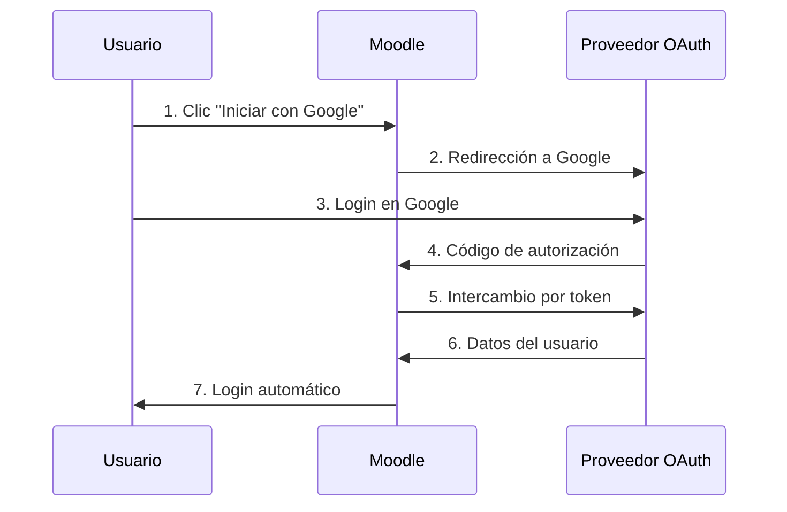

# 🔐 Guía Completa: OAuth 2.0 y SAML en Moodle

## 📋 Tabla de Contenidos

1. [¿Qué es OAuth 2.0?](#qué-es-oauth-20)
2. [¿Cómo funciona OAuth 2.0 en Moodle?](#cómo-funciona-oauth-20-en-moodle)
3. [Configuración de Google OAuth 2.0](#configuración-de-google-oauth-20)
4. [Configuración de Microsoft Azure AD](#configuración-de-microsoft-azure-ad)
5. [SAML 2.0 como alternativa](#saml-20-como-alternativa)
6. [Comparación OAuth vs SAML](#comparación-oauth-vs-saml)
7. [Implementación paso a paso](#implementación-paso-a-paso)
8. [Consideraciones de seguridad](#consideraciones-de-seguridad)
9. [Troubleshooting](#troubleshooting)

---

## 🔐 ¿Qué es OAuth 2.0?

**OAuth 2.0** es un protocolo de autorización que permite a las aplicaciones acceder a recursos de usuario sin exponer credenciales.

### 📊 Flujo básico de OAuth 2.0:



### 🎯 Ventajas para entornos médicos:

- ✅ **Single Sign-On (SSO)**: Un solo login para múltiples aplicaciones
- ✅ **Seguridad centralizada**: Gestión de contraseñas en un solo lugar
- ✅ **Cumplimiento normativo**: Facilita cumplir con regulaciones médicas
- ✅ **Gestión de usuarios**: Sincronización automática con Active Directory
- ✅ **Auditoría**: Logs centralizados de accesos

---

## 🔧 Cómo funciona OAuth 2.0 en Moodle

### 📚 Componentes principales:

1. **Authorization Server**: Servidor que maneja autenticación (Google, Microsoft)
2. **Resource Server**: Servidor con recursos del usuario (Google API)
3. **Client**: Aplicación Moodle
4. **Resource Owner**: Usuario médico

### 🔄 Proceso de autenticación:

```bash
┌─────────────────────────────────────────────────────────────┐
│ 1. Usuario hace clic en "Iniciar sesión con Google"        │
├─────────────────────────────────────────────────────────────┤
│ 2. Moodle redirige a Google con:                           │
│    • Client ID                                             │
│    • Redirect URI                                          │
│    • Scope (permisos solicitados)                         │
├─────────────────────────────────────────────────────────────┤
│ 3. Google autentica al usuario                            │
├─────────────────────────────────────────────────────────────┤
│ 4. Google envía código de autorización a Moodle          │
├─────────────────────────────────────────────────────────────┤
│ 5. Moodle intercambia código por Access Token            │
├─────────────────────────────────────────────────────────────┤
│ 6. Moodle usa token para obtener datos del usuario       │
├─────────────────────────────────────────────────────────────┤
│ 7. Usuario logueado automáticamente en Moodle            │
└─────────────────────────────────────────────────────────────┘
```

---

## 🔵 Configuración de Google OAuth 2.0

### 📋 Pasos en Google Cloud Console:

1. **Crear proyecto en Google Cloud Console**
   ```
   https://console.developers.google.com/
   ```

2. **Habilitar APIs necesarias**
   - Google+ API (depreciada pero necesaria)
   - Google OAuth2 API
   - Google People API

3. **Crear credenciales OAuth 2.0**
   - Tipo: Aplicación web
   - URI de redirección: `http://34.72.133.6/admin/oauth2callback.php`

4. **Configurar pantalla de consentimiento**
   - Nombre: "Moodle Medical Training"
   - Dominio autorizado: `34.72.133.6`

### 🔧 Configuración en Moodle:

```php
// Ejecutar: php setup_google_oauth.php
$google_config = [
    'name' => 'Google',
    'clientid' => 'TU_GOOGLE_CLIENT_ID',
    'clientsecret' => 'TU_GOOGLE_CLIENT_SECRET',
    'baseurl' => 'https://accounts.google.com',
];
```

### 🔗 Endpoints de Google:

- **Authorization**: `https://accounts.google.com/o/oauth2/v2/auth`
- **Token**: `https://oauth2.googleapis.com/token`
- **User Info**: `https://openidconnect.googleapis.com/v1/userinfo`

---

## 🟦 Configuración de Microsoft Azure AD

### 📋 Configuración en Azure Portal:

1. **Registrar aplicación en Azure AD**
   ```
   https://portal.azure.com/
   → Azure Active Directory → App registrations
   ```

2. **Configurar aplicación**
   - Nombre: "Moodle Medical Training"
   - URI de redirección: `http://34.72.133.6/admin/oauth2callback.php`
   - Tipo: Web

3. **Configurar permisos API**
   - Microsoft Graph:
     - `User.Read`
     - `openid`
     - `profile`
     - `email`

4. **Crear secreto de cliente**
   - Certificados y secretos → Nuevo secreto de cliente

### 🔧 Configuración en Moodle:

```php
// Ejecutar: php setup_microsoft_oauth.php
$tenant_id = 'TU_TENANT_ID';
$microsoft_config = [
    'name' => 'Microsoft',
    'clientid' => 'TU_MICROSOFT_CLIENT_ID',
    'clientsecret' => 'TU_MICROSOFT_CLIENT_SECRET',
    'baseurl' => "https://login.microsoftonline.com/$tenant_id",
];
```

### 🔗 Endpoints de Microsoft:

- **Authorization**: `https://login.microsoftonline.com/{tenant}/oauth2/v2.0/authorize`
- **Token**: `https://login.microsoftonline.com/{tenant}/oauth2/v2.0/token`
- **User Info**: `https://graph.microsoft.com/v1.0/me`

---

## 🔒 SAML 2.0 como alternativa

### 📊 ¿Cuándo usar SAML 2.0?

- ✅ **Entornos empresariales** con Active Directory
- ✅ **Máxima seguridad** requerida
- ✅ **Cumplimiento normativo** estricto
- ✅ **Single Sign-On** entre múltiples aplicaciones
- ✅ **Gestión centralizada** de usuarios

### 🔧 Configuración SAML:

```php
// Ejecutar: php setup_saml_sso.php
$saml_settings = [
    'auth_saml2/idpname' => 'Hospital SSO',
    'auth_saml2/entityid' => 'http://34.72.133.6/auth/saml2/sp/metadata.php',
    'auth_saml2/autocreate' => '1',
    'auth_saml2/duallogin' => '1',
];
```

### 📄 Componentes SAML:

- **Identity Provider (IdP)**: Active Directory Federation Services
- **Service Provider (SP)**: Moodle
- **Metadata**: Configuración XML intercambiada
- **Assertions**: Tokens con información del usuario

---

## ⚖️ Comparación OAuth vs SAML

| Aspecto | OAuth 2.0 | SAML 2.0 |
|---------|-----------|----------|
| **Protocolo** | Autorización | Autenticación |
| **Formato** | JSON | XML |
| **Complejidad** | Más simple | Más complejo |
| **Seguridad** | Buena | Excelente |
| **Casos de uso** | APIs, Mobile | Empresarial, SSO |
| **Implementación** | Rápida | Lenta |
| **Debugging** | Fácil | Difícil |

### 🏥 Recomendaciones para hospitales:

```bash
🔵 USA OAUTH 2.0 SI:
├── Implementación rápida (< 1 semana)
├── Integración con Google Workspace
├── Equipo pequeño de TI
└── Presupuesto limitado

🔒 USA SAML 2.0 SI:
├── Máxima seguridad requerida
├── Active Directory existente
├── Cumplimiento normativo estricto
└── Múltiples aplicaciones SSO
```

---

## 🚀 Implementación paso a paso

### 📋 Fase 1: Preparación (1 día)

1. **Evaluar infraestructura existente**
   ```bash
   # Verificar plugins necesarios
   kubectl exec -it moodle-684db8486b-5c5zp -- ls /bitnami/moodle/auth/
   ```

2. **Decidir proveedor OAuth**
   - Google: Para equipos pequeños, implementación rápida
   - Microsoft: Para hospitales con Office 365
   - SAML: Para máxima seguridad

### 📋 Fase 2: Configuración del proveedor (2 días)

1. **Google OAuth 2.0**
   ```bash
   # Ejecutar en el pod de Moodle
   kubectl exec -it moodle-684db8486b-5c5zp -- php /bitnami/moodle/setup_google_oauth.php
   ```

2. **Microsoft Azure AD**
   ```bash
   kubectl exec -it moodle-684db8486b-5c5zp -- php /bitnami/moodle/setup_microsoft_oauth.php
   ```

### 📋 Fase 3: Configuración de Moodle (1 día)

1. **Habilitar OAuth 2.0**
   ```bash
   kubectl exec -it moodle-684db8486b-5c5zp -- php /bitnami/moodle/setup_oauth2.php
   ```

2. **Configurar mapeo de campos**
   ```php
   $field_mappings = [
       'email' => 'email',
       'firstname' => 'given_name',
       'lastname' => 'family_name',
       'department' => 'department', // Para especialidades médicas
   ];
   ```

### 📋 Fase 4: Testing (1 día)

1. **Pruebas de autenticación**
   - Login con diferentes usuarios
   - Verificar mapeo de campos
   - Probar logout

2. **Pruebas de seguridad**
   - Tokens de sesión
   - Timeouts
   - Permisos de usuario

---

## 🔐 Consideraciones de seguridad

### 🛡️ Configuraciones obligatorias:

1. **HTTPS obligatorio**
   ```bash
   # Configurar SSL/TLS
   kubectl create secret tls moodle-tls \
     --cert=path/to/cert.crt \
     --key=path/to/cert.key
   ```

2. **Validación de certificados**
   ```php
   $oauth_settings = [
       'auth_oauth2/requirehttps' => '1',
       'auth_oauth2/verifycert' => '1',
   ];
   ```

3. **Timeout de sesión**
   ```php
   $session_settings = [
       'sessiontimeout' => '3600', // 1 hora
       'sessioncookie' => 'MoodleSession',
   ];
   ```

### 🚨 Alertas de seguridad:

- **Nunca** hardcodear credenciales en código
- **Siempre** usar variables de entorno
- **Rotar** secretos regularmente
- **Monitorear** logs de autenticación
- **Implementar** rate limiting

---

## 🔧 Troubleshooting

### 🐛 Problemas comunes:

#### **Error: "Invalid redirect URI"**
```bash
# Verificar URLs configuradas
Configurado en proveedor: http://34.72.133.6/admin/oauth2callback.php
Configurado en Moodle: http://34.72.133.6/admin/oauth2callback.php
```

#### **Error: "Token validation failed"**
```bash
# Verificar tiempo del servidor
kubectl exec -it moodle-684db8486b-5c5zp -- date
# Sincronizar con NTP si es necesario
```

#### **Error: "User not found"**
```bash
# Verificar mapeo de campos
SELECT * FROM mdl_config WHERE name LIKE 'auth_oauth2%field%';
```

### 📊 Logs útiles:

```bash
# Logs de autenticación OAuth
kubectl logs moodle-684db8486b-5c5zp | grep oauth

# Logs de base de datos
kubectl logs moodle-mariadb-0 | grep oauth

# Logs de errores PHP
kubectl exec -it moodle-684db8486b-5c5zp -- tail -f /opt/bitnami/apache/logs/error_log
```

---

## 📋 Checklist de implementación

### ✅ Pre-implementación:
- [ ] Evaluar infraestructura existente
- [ ] Decidir proveedor OAuth (Google/Microsoft/SAML)
- [ ] Obtener credenciales del proveedor
- [ ] Configurar DNS si es necesario
- [ ] Planificar migración de usuarios

### ✅ Implementación:
- [ ] Configurar proveedor OAuth
- [ ] Instalar plugins necesarios
- [ ] Configurar Moodle
- [ ] Mapear campos de usuario
- [ ] Configurar grupos y roles

### ✅ Post-implementación:
- [ ] Probar con usuarios piloto
- [ ] Documentar proceso
- [ ] Capacitar administradores
- [ ] Configurar monitoreo
- [ ] Planificar mantenimiento

---

## 🔗 Enlaces útiles

- [Documentación oficial OAuth 2.0](https://oauth.net/2/)
- [Moodle OAuth 2.0 documentation](https://docs.moodle.org/en/OAuth_2_services)
- [Google OAuth 2.0 documentation](https://developers.google.com/identity/protocols/oauth2)
- [Microsoft Azure AD documentation](https://docs.microsoft.com/en-us/azure/active-directory/)
- [SAML 2.0 specification](https://docs.oasis-open.org/security/saml/v2.0/)

---

## 📞 Soporte

Para problemas específicos con la implementación OAuth 2.0 en tu entorno médico, contacta al equipo de desarrollo con:

- Logs de error específicos
- Configuración utilizada (sin credenciales)
- Pasos para reproducir el problema
- Información del entorno (versión Moodle, proveedor OAuth)

**¡OAuth 2.0 facilita significativamente el acceso seguro para personal médico!** 🏥🔐